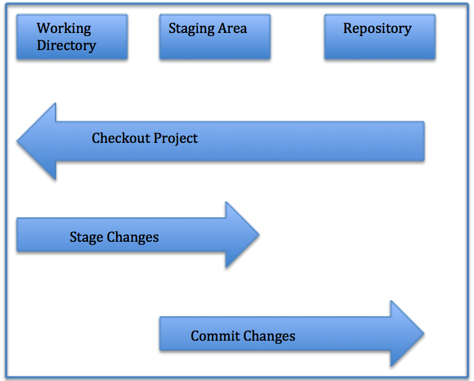

# Git Intro

## What is Git?

### Git is a DVCS (Distributed Version Control system) that stores data in a file system made up of snapshots , Git mostly relies on local operations because most necessary information can be found in local resources , Git will always detect file corruption or loss of information in transit.

## The main states of files in Git:

 

## Some command used in Git:

- git add . (added my project and prepare it)
- git status (to know the status of my transaction)
- git commit -m" " (to commit your project with a message)
- git push origin master (to push the project into the github)
- git pull origin master (to pull the project from the github)