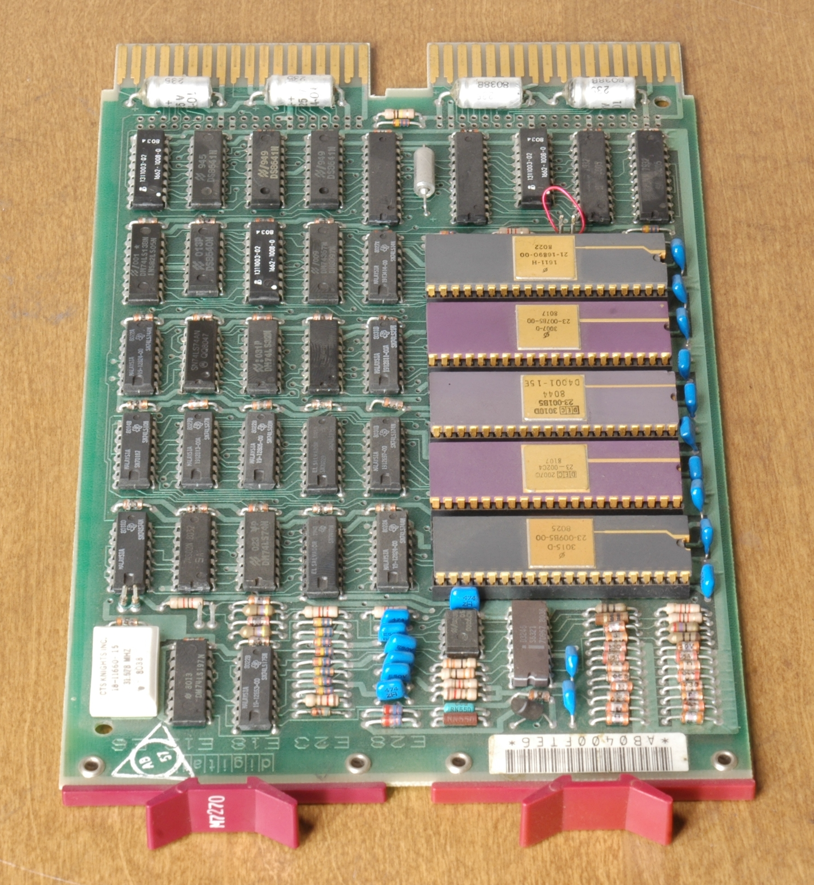

# Computers

## how computer works?

### in general its works in some important steps , first step is take input and then storage these inputs to process it and will be ready to output to end users.

### some component of computers:

* Motherboard.

* Processor/CPU.

* Power Supply.

* Hard Drive.

* etc...

